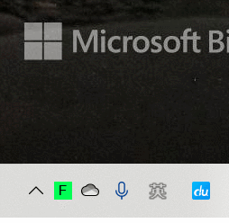

# French Type Helper
[English]  [[中文]](./README_zh.md)

A French Accent Tool for Windows.  
You Could type French Accents easily without French IME.  

## Usage 
step1: download the latest release  [[From Github]](https://github.com/dnalm/FrenchTypeHelper/releases) [[From Gitee]](https://gitee.com/dreamness/FrenchTypeHelper/releases)

step2: unzip it, move it to somewhere you love  
step3: just run `FrenchTypeHelper_WPF.exe` !  

If you want to change any configurations, you could find a icon on right bottom screen, right click it.


## Tip (default configurations)
|               | type in         | result             |
|-------------------|-----------------|--------------------|
| hotkey            | **Ctrl** + **'**(quote) | **enabled** / **disabled** |
| grave accent      | **a**/**e**/**u** + **]**   |        **à**/**è**/**ù**           |
| acute accent      | **e** + **[**           |          **é**             |
| circumflex accent | **a**/**e**/**u**/**o/i** + **-**  |           **â**/**ê**/**û**/**ô**/**î**         |
| cedilla           | **c** + **/**          |           **ç**            |
| diaeresis         | **e**/**u**/**i** + **=**       |         **ë**/**ü**/**ï**           |
| open quote        | **<** + **<**           |              **«**       |
| close quote       | **>** + **>**           |       **»**              |

**All of them could be modified.**  
  
## Compile
step1: clone this repo  
step2: run the command in the project folder
```shell
nuget.exe restore  .\FrenchTypeHelper.sln
```
step3: open project with Rider or Visual Studio  and compile , run !
