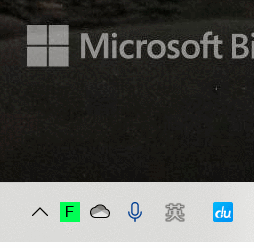
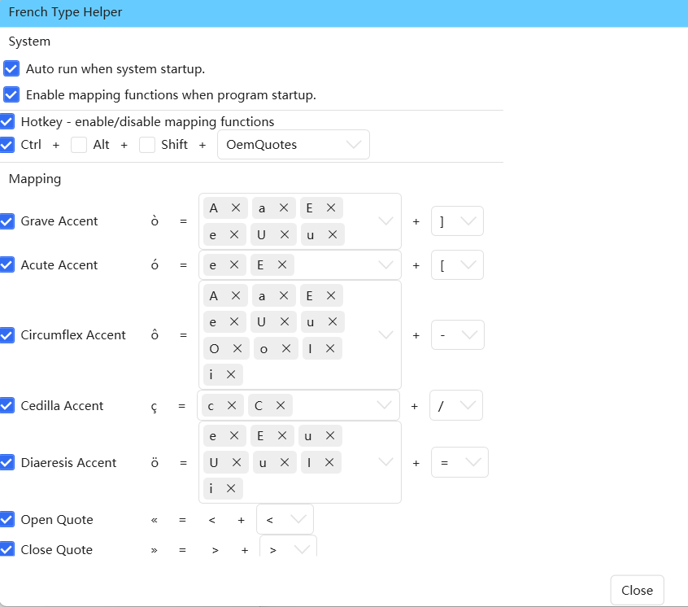

# French Type Helper 法语输入助手
[[English]](./README.md)  [中文]  

法语变音符号输入工具, 可运行在Windows上.
使用该软件可以轻松快速地输入法语变音符号, 甚至可以中/英/法混输! 无需使用繁琐的法语输入法!
 

## Usage 
step1: [下载最新版本](https://github.com/dnalm/FrenchTypeHelper/releases)  
step2: 解压缩, 并将文件放到合适的位置
step3: 运行可执行文件 `FrenchTypeHelper_WPF.exe` !  

如果想要修改快捷键, 可以右键点击系统托盘图标.  


## 使用帮助 (默认配置)
|               | 输入                                | 结果                            |
|---------------|-----------------------------------|-------------------------------|
| 快捷键           | **Ctrl** + **'**(quote)           | **enabled** / **disabled**    |
| grave accent  | **a**/**e**/**u** + **]**         | **à**/**è**/**ù**             |
| acute accent  | **e** + **[**                     | **é**                         |
| circumflex accent | **a**/**e**/**u**/**o/i** + **-** | **â**/**ê**/**û**/**ô**/**î** |
| cedilla       | **c** + **/**                     | **ç**                         |
| diaeresis     | **e**/**u**/**i** + **=**         | **ë**/**ü**/**ï**             |
| 左引号open quote | **<** + **<**                     | **«**                         |
| 右引号 close quote | **>** + **>**                     | **»**                         |

**所有均可配置**  
  
## 编译
step1: 克隆该仓库  
step2: 在项目文件夹中运行
```shell
nuget.exe restore  .\FrenchTypeHelper.sln
```
step3: 使用Rider或Visual Studio打开项目, 然后直接编译运行!
